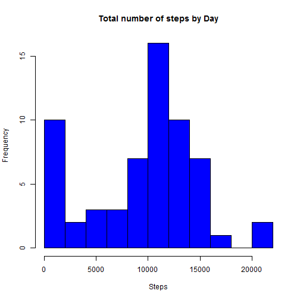
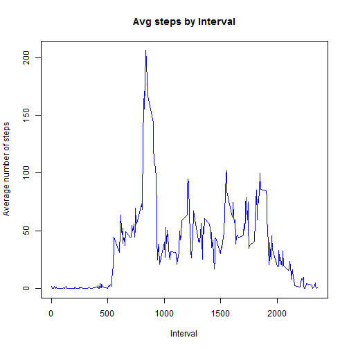
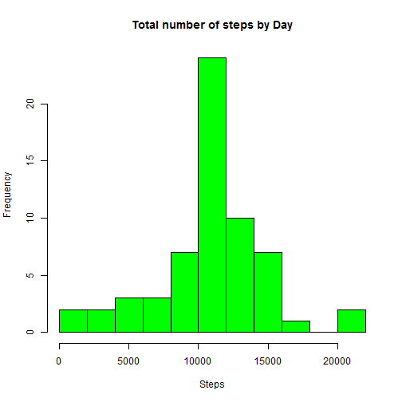
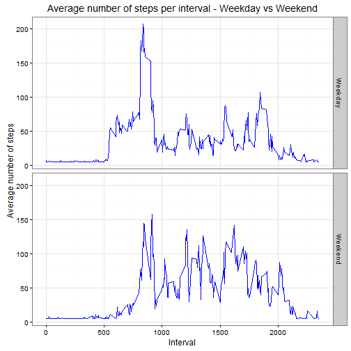

## Introduction

In this document we will analyse the personal activity data collected over 2 months from a activity tracking device. The analysis will show the mean activity in number of steps, it will also show the trend of activity by interval and how this is different on weekdays and weekends.

### Pre-processing steps

Load the necessary libraries

```r
library(ggplot2)
```


Read the activity file and create a copy for comparison after NAs are filled


```r
activityTab<-read.csv("activity.csv")
activityDf<-activityTab
```


### Processing to generate the plots and mean and median

First we create a table with the sum of steps by Date
We ignore the value with NA for this computation


```r
stepsbyDate<-aggregate(activityTab$steps,by=list(activityTab$date),sum,na.rm=T)
names(stepsbyDate)<-c("date","steps")
```

Now we create a histogram to see the distribution of step count


```r
hist(stepsbyDate$steps,xlab="Steps",main="Total number of steps by Day",breaks=10,col="blue")
```



```r
meanst<-mean(stepsbyDate$steps)
medst<-median(stepsbyDate$steps)
```

**Mean steps :** 9354

**Median steps :** 10395


Create a summary table with Interval and average number of steps
Plot the average number of steps by interval in a time series plot


```r
xyTab<-aggregate(activityTab$steps,list(activityTab$interval),mean,na.rm=T)
names(xyTab)<-c("Interval","Avg_Steps")
with(xyTab,plot(Interval,Avg_Steps,type='l',col="blue",main="Avg steps by Interval",ylab="Average number of steps"))
```



Interval with the maximum average number of steps


```r
xyTab$Interval[xyTab$Avg_Steps==max(xyTab$Avg_Steps)]
```

```
## [1] 835
```

### Data tranformation for plots with NAs filled based on averages
Convert date field to date type
Calculate the average number of steps taken during an interval
Calculate and display the total number of missing step values in the dataset


```r
activityDf$date<-as.Date(activityDf$date)
meanStep<-round(mean(activityDf$steps,na.rm=T),0)
missingVal<-length(activityDf$steps[is.na(activityDf$steps)])
```

**Total number of NA values values in steps:** 2304

Replace the average step value wherever is it NA


```r
activityDf$steps[is.na(activityDf$steps)]<-meanStep
```

Recreate the histogram


```r
stepsbyDate2<-aggregate(activityDf$steps,by=list(as.character(activityDf$date)),sum,na.rm=T)
names(stepsbyDate2)<-c("date","steps")
hist(stepsbyDate2$steps,xlab="Steps",main="Total number of steps by Day",breaks=10,col="green")
```



```r
meanst2<-mean(stepsbyDate2$steps)
medst2<-median(stepsbyDate2$steps)
diffmeanst<-mean(stepsbyDate2$steps)-mean(stepsbyDate$steps)
diffmedst<-median(stepsbyDate2$steps)-median(stepsbyDate$steps)
```

**Mean steps after filling NAs :** 10752

**Median steps after filling NAs :** 10656


**Difference in mean steps after NAs have been filled with average values :** 1398

**Difference in median steps after NAs have been filled with average values :** 261


### Difference in activity patterns on weekends vs weekdays

Create a function which helps identify dates that fall on the weekend and weekday
Apply the function to the ActivityDf and create a new field identifying all dates as weekdays or weekends

```r
wkfun<-function(anydate){
  if(weekdays(anydate) %in% c("Monday","Tuesday","Wednesday","Thursday","Friday")){
    "Weekday"}else{
      "Weekend"}
}

activityDf$DayType<-sapply(activityDf$date,wkfun)
```

Create a panel plot for weekday and weekend showing the trend of average number of steps by interval


```r
xyTabDT<-aggregate(activityDf$steps,list(activityDf$DayType,activityDf$interval),mean,na.rm=T)
names(xyTabDT)<-c("DayType","Interval","Avg_Steps")
g<-ggplot(xyTabDT,aes(Interval,Avg_Steps))
g+geom_line(col="blue")+facet_grid(DayType~.)+theme_bw()+ylab("Average number of steps")+ggtitle("Average number of steps per interval - Weekday vs Weekend")
```



